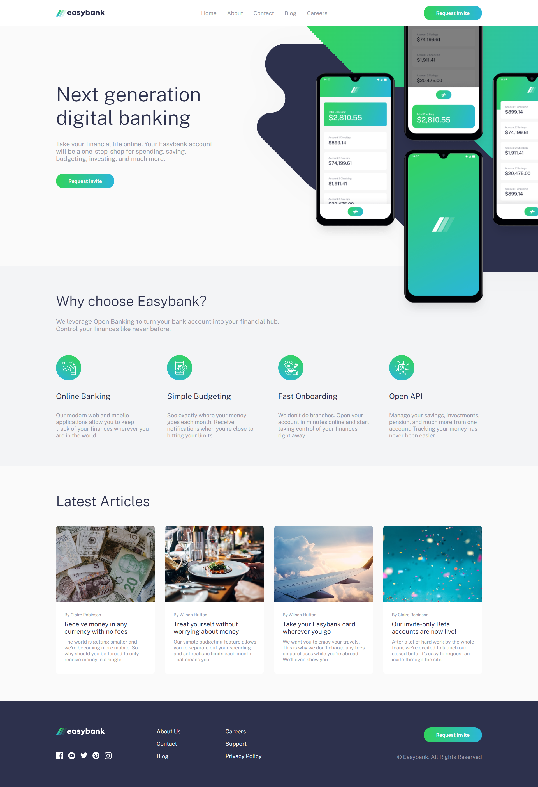

# 🏦 Landing Page Easybank (Frontend Mentor) 

Este projeto foi desenvolvido como parte do desafio [Digital bank landing page](https://www.frontendmentor.io/challenges/easybank-landing-page-WaUhkoDN) da [Frontend Mentor](https://www.frontendmentor.io/home), com o objetivo de replicar o design de uma interface moderna para um banco digital fictício, o Easybank.

No projeto, meu foco principal foi praticar conceitos fundamentais de HTML semântico, estilização com Sass e interatividade com JavaScript puro, além de aplicar boas práticas de responsividade para dispositivos desktop e mobile.

## 🎯 O Desafio

Os usuários devem ser capazes de:

- Visualizar o layout ideal do site dependendo do tamanho da tela do dispositivo
- Ver os estados de hover para todos os elementos interativos da página

## 👀 Preview

## 🔗 Links

- [Solução](https://www.frontendmentor.io/solutions/responsive-easybank-landing-page-KMoyxWACQr)
- [Site publicado](https://digital-bank-lp-fem.vercel.app/)

## ⚙️ Funcionalidades

- 📱 **Layout responsivo** adaptado para desktop e dispositivos móveis  
- 🍔 **Menu hambúrguer** para navegação em dispositivos móveis  
- 🎨 **Transições suaves** que aprimoram a experiência visual

## 💻 Tecnologias usadas

<!--
## 💻 Tecnologias usadas

-->

## 👨‍💻 Autor

### **Erik Alves**

